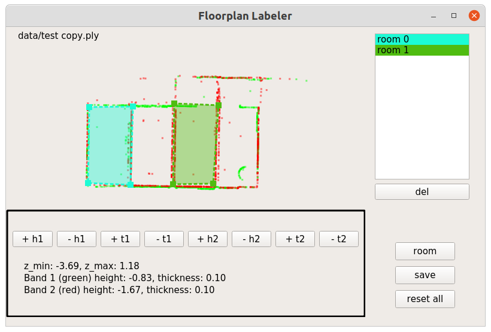

# Floorplan labeling tool

## How to install

1. We recommand you to use [Anaconda](https://www.anaconda.com/products/individual) to create the environment. Then, you can setup the environnment with:
    ```
    conda env create -n floorplan_label
    ```

    And directly run to install the packages.
    ```
    pip install  -r requirement.txt
    ```

    #### Requirements
    * python >= 3.7
    * PyQt5
    * numpy
    * plyfile

2. Please install MeshLab for further visualization. You can find the install package [here](https://www.meshlab.net/#download).


## How to run and use?
```
python app.py PLY_DATA_DIR OUTPUT_DIR
```
This will read all `.ply` files in `PLY_DATA_DIR`.
Currently, the output annotation will be saved as `[SCENE_NAME].json` in `OUTPUT_DIR` where `SCENE_NAME` is the name of the `.ply` file.

1. Left-click the point cloud to label corners. Right-click undo the labeling
2. `W`, `A`, `S`, `D` to move point cloud 
3. `E`, `R` to rotate point cloud
4. Scroll to zoom in and out
5. Click `room` or `axis` button on bottom right to switch labeling mode
6. Click `save` button to save result
7. `P`: previous scene. `N`: next scene
8. The bottom panel shows the height for the two slice. Users can adjust the values to view the different slice from the projection. The thickness for each slice is set as 0.1 as default.

## Screenshot

